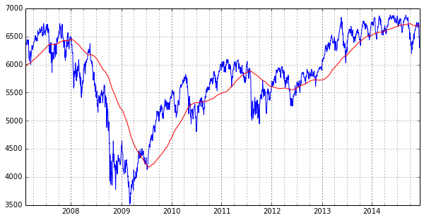

Quant
=====

The mython.quant package. Example import:

.. code-block:: python

    import mython.quant as quant

.. _quant-downloading:

Downloading data
----------------

You can obtain a decade's worth of data from Yahoo using the command line::

    quant --decade npt.l

or programmatically::

    get_decade("NPT.L")

You will then likely want to process the download further by using csvh5 to convert the data to HDF5 format::

    csvh5 npt.l

Derived calculations can be performed on it by editing the control file ``hdf5ex.txt``, and then running ``hdf5ex``. These can found in ``/projects/repos/cerbo/fortran``

.. seealso::

   :ref:`csv-to-hdf5`

Indices
~~~~~~~

Yahoo index code is as follows:

====== =============
  Sym   Description
------ -------------
 ^FTSE FTSE 100
 ^FTMC FTSE MID 250
 ^FTAI FTSE AIM
====== =============

To, to retrieve details for the Footsie (FSTE 100) for the last decade, you would issue
the command:

.. code-block:: python

    quant.get_decade("^FTSE")

Yahoo URL
~~~~~~~~~

Information about compsoing a url from a ticker is available at the following locations:

* `CSV Historical Quotes Download <https://code.google.com/p/yahoo-finance-managed/wiki/csvHistQuotesDownload>`_
* `Using the yahoo Finance API for CSV <http://www.jarloo.com/yahoo_finance/>`_
* `Yahoo Finance (hidden) API <https://greenido.wordpress.com/2009/12/22/yahoo-finance-hidden-api/>`_

Plotting data
-------------

Here is a prototypical plot on a symbol against date, including a 200dMA, with date axes split into quarters:

.. code-block:: python

    df = quant.load_to_pandas("^FTSE")
    df['dma'] = pd.stats.moments.rolling_mean(df['Close'], 200)
    df = df[df['Date']>= "2007-02"]
    fig, ax = plt.subplots(nrows = 1, ncols = 1)
    fig.set_size_inches(10, 5)
    quant.date_axes_quarterly(ax)
    ax.plot(df['DateObj'], df['Close'])
    ax.plot(df['DateObj'], df['dma'], color = 'r')
    plt.show()

The output might look something like:

Statistics
----------

Relative strength
~~~~~~~~~~~~~~~~~

It can be calculated for any number of days, although the default is 14:

.. code-block:: python

    df = quant.load_to_pandas("DTG.L")
    fig, ax = plt.subplots(nrows = 1, ncols = 1)
    fig.set_size_inches(10, 5)
    quant.date_axes_quarterly(ax)
    df['rsi14'] = quant.relative_strength(np.array(df['Close']))
    df = df[df['Date'] >= "2014"]
    ax.plot(df['DateObj'], df['rsi14'])

For comparison purposes, here are the results obtained from various sources, for DTG.L, taken on Sat 13-Dec-2014:

+-------------+--------+
| Source      | RSi14d |
+=============+========+
| Barchart    |  64.09 |
+-------------+--------+
| Google      |  68.57 |
+-------------+--------+
| Stockopedia |  64.09 |
+-------------+--------+
| quant       |  64.09 |
+-------------+--------+

The ``quant`` module produces results that seem to match exactly with Barchart. Barchart and Stockopedia can diverge; although on this occasion they are the same. It is difficult to know how Google obtain their results. I repeated the experiement with TSCO.L. For Barchart and ``quant`` I obtained 29.17%, whereas for Google it was 20.8%. There is clearly something wrong with the way that google performs its calculations.

Module documents
----------------

.. automodule:: mython.quant
   :members:
